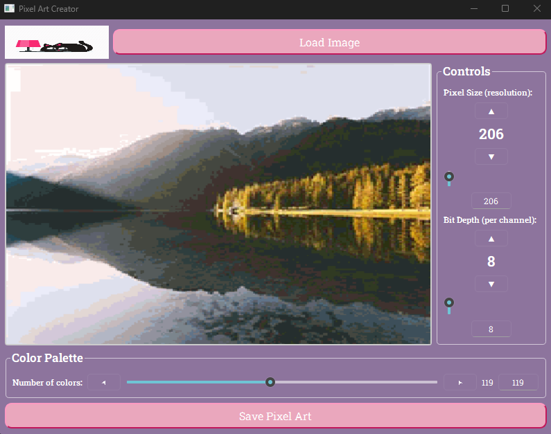

# Team Project For CST205

## Application Preview



## Future works

implement 'before/after' branch, qml for before and after slider comparison

## Download

[Download the project as a ZIP file](https://github.com/F0rehe4d/pixel-art-image-editor/archive/refs/heads/main.zip)

## How to Run

1. Install Python 3.
2. Download and extract the ZIP file.
3. Open a terminal inside the extracted folder.
4. Install the required packages:

```bash
pip install -r requirements.txt
```

## My Contributions

I contributed substantially to the development and presentation of this project, including:

- Designed and improved the graphical user interface
- Worked on the visual style, layout, colors, buttons, and overall user experience
- Implemented and improved application functionality
- Helped integrate the interface with the pixel-art editing features
- Tested the application and fixed issues
- Prepared the project presentation, screenshots, and documentation
